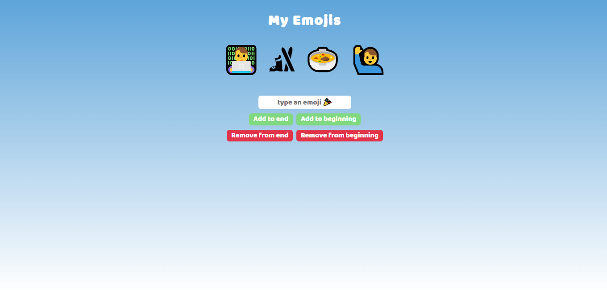

# Emoji-Adding-App

## Table of Content

 * [Overview of the Project](#overview-of-the-project)
      * [Goal of the project](#goal-of-the-project)
      * [Screenshot](#screenshot)
 * [Technologies I Used](#technologies-i-used)
 * [What I Learned](#what-i-learned) 
 * [Acknowledgment](#acknowledgment)

# Overview of the Project
This App is basically focused on adding your favorite emojis.

### Goal of the Project
* To style the project with HTML and CSS.
* To add emojis in the beginning.
* To add emojis in the end.

## Screenshot

## Technologies I Used
* Semantic HTML5
* CSS
* Javascript

## What I Learned
* Styling the website with HTML and CSS
* Learned about textContent, append, push, pop, shift and unshift.

## Acknowledgment
   My acknowledgements go out to the team at Scrimba. Enrolling in your courses made this project possible.

